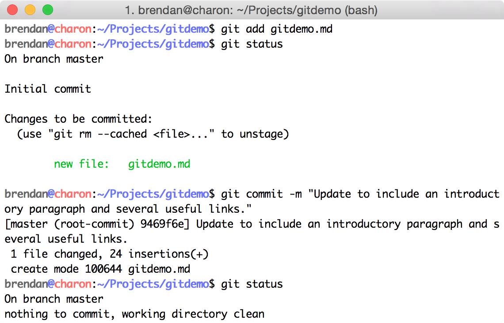
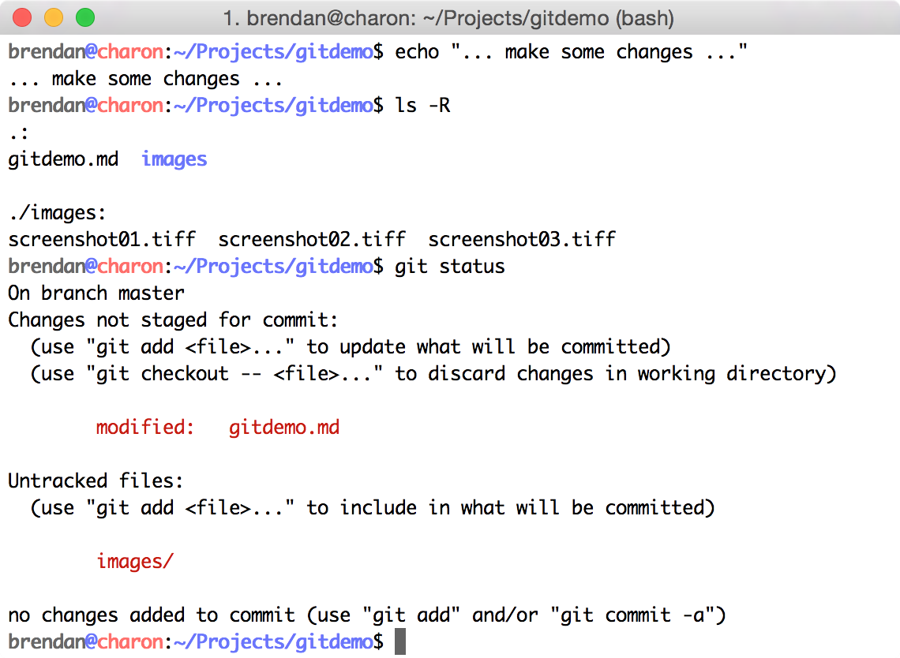
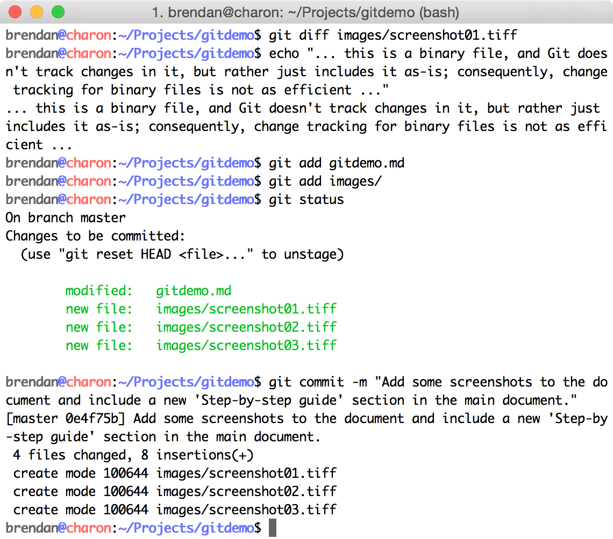
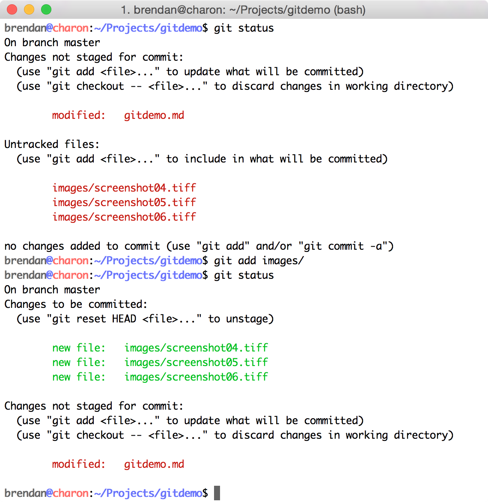
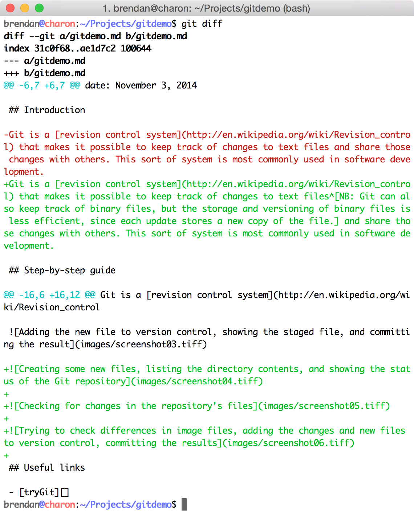
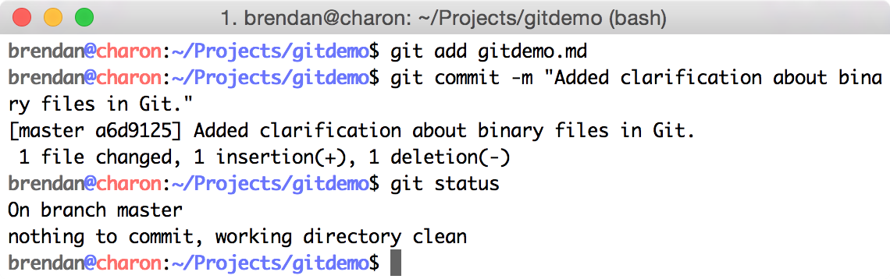
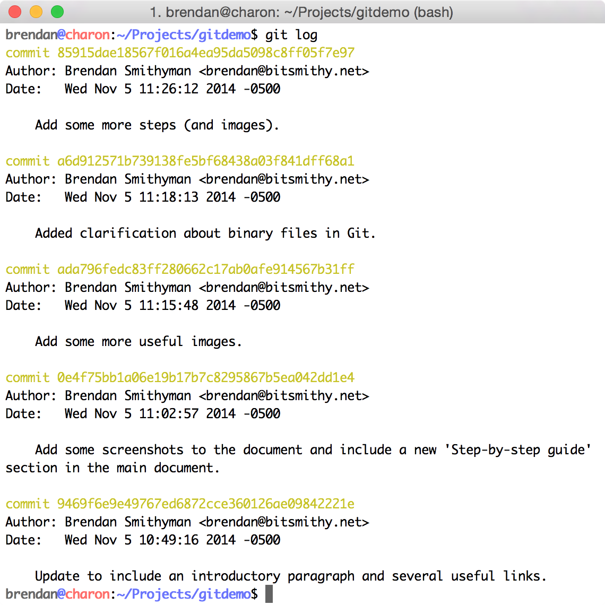
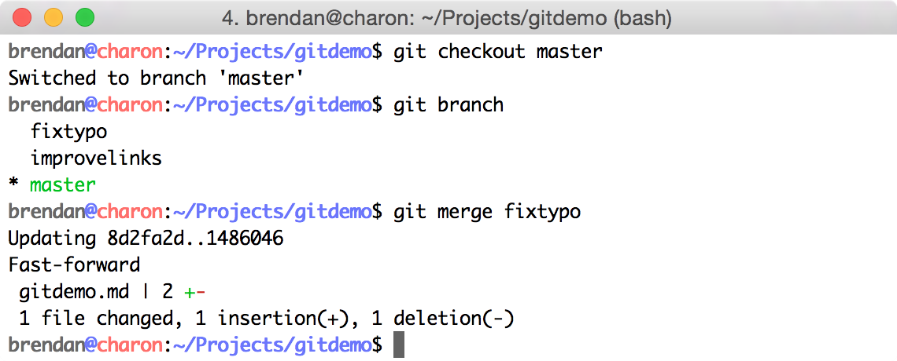

## Introduction

Git is a [revision control system](http://en.wikipedia.org/wiki/Revision_control) that makes it possible to keep track of changes to text files^[NB: Git can also keep track of binary files, but the storage and versioning of binary files is less efficient, since each update stores a new copy of the file.] and share those changes with others. This sort of system is most commonly used in software development.

## Rough examples

Here are some examples that might help you in getting started!

### Initializing a repository

### Adding new files and changes

### Atomic commits and selecting changes

### More changes, and showing logs

### Branching and merging

## Useful links

### Tutorials

- [tryGit][]
- [Atlassian Git Tutorials][AtlassianTutor]
- [Official Git Documentation][GitSCMDoc]

### Documents

- [Git Internals PDF][GitInternals]
- [Think Like (a) Git][TLaG]

### Talks

- [Git for ages 4 and up][4andUp]

### Hosting services

- [GitHub][]
- [BitBucket][]

[tryGit]: https://try.github.io
[AtlassianTutor]: https://www.atlassian.com/git/tutorials
[GitSCMDoc]: http://git-scm.com/doc
[GitInternals]: https://github.com/pluralsight/git-internals-pdf
[4andUp]: https://www.youtube.com/watch?v=1ffBJ4sVUb4
[TLaG]: http://think-like-a-git.net
[GitHub]: https://github.com
[BitBucket]: https://bitbucket.org
